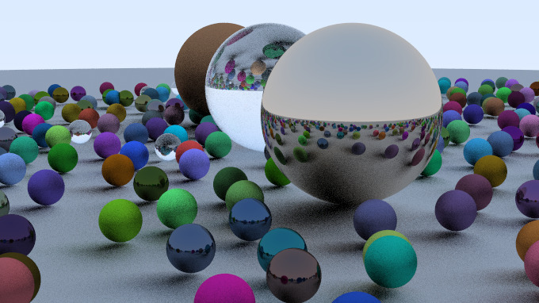
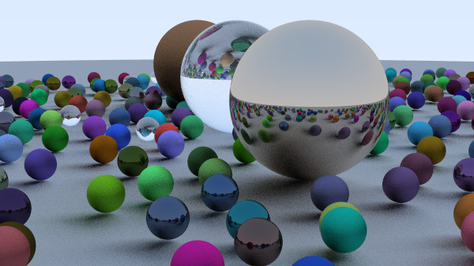

## Table of contents

- [Overview](#overview)
  - [Example renders](#example-renders)
- [Installation](#installation)
- [Useful commands](#useful-commands)
  - [Effekt commands](#effekt-commands)
  - [Nix-related commands](#nix-related-commands)
- [Example projects](#example-projects-using-this-template)
- [Repository structure](#repository-structure)
- [CI](#ci)

---

## Overview

This project is part of the "Effective programming with Effect" course at the University of Tuebingen.
The aim of this project was to implement a simple raytracer based on [_Ray Tracing in One Weekend_](https://raytracing.github.io/books/RayTracingInOneWeekend.html) in the Effekt programming language.

"src/main.effekt" contains the scene, camera & rendering parameters that can be customized. The program will render an image based on the parameters and produce an image at "out.ppm".

### Example renders

<div style="display: grid; grid-template-columns: 32% 32% 32%; column-gap: 5px; text-align: center;">
   
   
   
   <p>10 samples, 2 bounces</p>
   <p>50 samples, 5 bounces</p>
   <p>100 samples, 10 bounces</p>
</div>


## Installation

Only requires the Effekt language https://effekt-lang.org/docs to be installed with at least one working backend. LLVM is recommended.

## Useful commands

### Effekt commands

Run the main file:
```sh
effekt src/main.effekt
```
This (like many other Effekt commands) uses the JavaScript backend by default.
To use a different backend, add the `--backend <backend>` flag. 
The LLVM backend `--backend llvm` is recommended for speed, but all backends that support writing files should be supported.
Only LLVM and JavaScript have been tested.

Run the tests:
```sh
effekt src/test.effekt
```

Open the REPL:
```sh
effekt
```

Build the project:
```sh
effekt --build src/main.effekt
```
This builds the project into the `out/` directory, creating a runnable file `out/main`.

To see all available options and backends, run:
```sh
effekt --help
```

### Nix-related commands

While Nix installation is optional, it provides several benefits:

Update dependencies (also runs automatically in CI):
```sh
nix flake update
```

Open a shell with all necessary dependencies:
```sh
nix develop
```

Run the main entry point:
```sh
nix run
```

Build the project (output in `result/bin/`):
```sh
nix build
```

## Example projects using this template

- [see the `effekt-community` GitHub organization](https://github.com/effekt-community/)
- This very project!

## Repository structure

- `.github/workflows/*.yml`: Contains the [CI](#ci) definitions
- `src/`: Contains the source code
  - `main.effekt`: Main entry point
  - `test.effekt`: Entry point for tests
  - `lib/`: Library code imported by `main` and `test`
- `flake.nix`: Package configuration in a Nix flake
- `flake.lock`: Auto-generated lockfile for dependencies
- `LICENSE`: Project license
- `README`: This README file

## CI

Two GitHub Actions are set up:

1. `flake-check`:
   - Checks the `flake.nix` file, builds and tests the project
   - Runs on demand, on `main`, and on PRs
   - To run custom commands, add a step using:
     - `nix run -- <ARGS>` to run the main entry point with the given arguments
     - `nix develop -c '<bash command to run>'` to run commands in the correct environment

2. `update-flake-lock`:
   - Updates package versions in `flake.nix`
   - Runs on demand and weekly (Tuesdays at 00:00 UTC)
